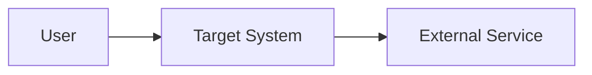

# Đặc tả yêu cầu phần mềm (Software Requirements Specification — SRS)

## 1. Giới thiệu, mục đích và phạm vi (Introduction, Purpose and Scope)

{Mục đích tài liệu, phạm vi sản phẩm, thuật ngữ và tài liệu tham chiếu.}

## 2. Bối cảnh sản phẩm (Product Context)

{Vấn đề, hệ thống hiện có, giá trị và vị trí sản phẩm trong hệ sinh thái.}

## 3. Các bên liên quan và nhóm người dùng (Stakeholders and User Classes)

| Nhóm | Mục tiêu | Quyền/khả năng | Tần suất sử dụng |
|---|---|---|---|
| {user class} | {goal} | {capability} | {frequency} |

## 4. Giả định, ràng buộc và phụ thuộc (Assumptions, Constraints and Dependencies)

### Giả định (Assumptions)
- {assumption}

### Ràng buộc (Constraints)
- {constraint}

### Phụ thuộc (Dependencies)
- {dependency}

## 5. Bối cảnh hệ thống (System Context)

## 6. Yêu cầu chức năng (Functional Requirements)

### FR-001 — {Tên requirement}

- **Mô tả (Description):** {Hệ thống phải...}
- **Lý do (Rationale):** {Giá trị/lý do.}
- **Nguồn (Source):** {Stakeholder/research.}
- **Ưu tiên (Priority):** Must/Should/Could/Won't.
- **Điều kiện trước (Preconditions):** {trạng thái}.
- **Đầu vào (Inputs):** {đầu vào}.
- **Hành vi mong đợi (Expected behavior):** {hành vi quan sát được}.
- **Ngoại lệ (Exceptions):** {error/hành vi thay thế}.
- **Tiêu chí chấp nhận (Acceptance criteria):** {Given/When/Then hoặc điều kiện đo được}.
- **Phụ thuộc (Dependencies):** {ID}.
- **Phương pháp xác minh (Verification method):** Test/Inspection/Demonstration/Analysis.

## 7. Yêu cầu phi chức năng (Non-functional Requirements)

### NFR-001 — {Tên quality requirement}

- **Đặc tính chất lượng (Quality characteristic):** {đặc tính ISO/IEC 25010}.
- **Cách đo (Measure):** {metric và phương pháp}.
- **Mục tiêu (Target):** {ngưỡng số}.
- **Điều kiện vận hành (Operating condition):** {tải/environment}.
- **Phương pháp xác minh (Verification method):** {test/analysis}.

## 8. Yêu cầu giao diện bên ngoài (External Interface Requirements)

| ID | Interface | Hướng | Protocol/Format | Contract | Hành vi khi lỗi |
|---|---|---|---|---|---|
| API-001 | {name} | In/Out | HTTPS/JSON | {link} | {behavior} |

## 9. Yêu cầu dữ liệu (Data Requirements)

{Data entity, quyền sở hữu, phân loại, retention, validation và lifecycle.}

## 10. Quy tắc nghiệp vụ (Business Rules)

### BR-001 — {Tên business rule}

{Quy tắc, nguồn, điều kiện áp dụng và ngoại lệ.}

## 11. Yêu cầu bảo mật và quyền riêng tư (Security and Privacy Requirements)

{Authentication, authorization, audit, encryption, privacy và secret handling.}

## 12. Tiêu chí nghiệm thu cấp sản phẩm (Acceptance Criteria)

| ID | Scenario | Kết quả mong đợi | Evidence |
|---|---|---|---|
| AC-001 | {scenario} | {outcome} | {test/UAT} |

## 13. Mức ưu tiên requirement (Requirement Priorities)

{Phương pháp ưu tiên và rationale.}

## 14. Truy vết (Traceability)

Liên kết đến Requirements Traceability Matrix: {đường dẫn hoặc URL}.

## 15. Vấn đề còn mở (Open Issues)

- {Vấn đề, owner, due date}.

## 16. Phê duyệt (Approval)

| Vai trò | Người duyệt | Quyết định | Ngày |
|---|---|---|---|
| Product Owner | {tên} | Chờ duyệt (Pending) | |

## AI tự kiểm tra (Self-check)

- [ ] Mỗi requirement có ID duy nhất và nguồn.
- [ ] Yêu cầu mô tả hành vi quan sát được, không khóa giải pháp không cần thiết.
- [ ] Acceptance criteria kiểm thử được.
- [ ] NFR có metric, target, điều kiện và phương pháp xác minh.
- [ ] Mâu thuẫn và dữ liệu thiếu nằm trong Open Issues/open_questions.
