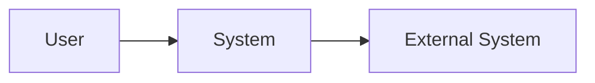
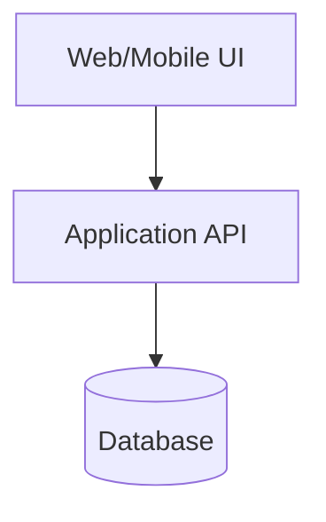
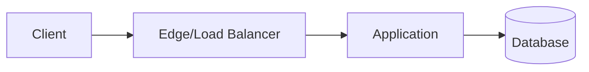

# Thiết kế cấp cao (High-Level Design — HLD)

## 1. Mục tiêu kiến trúc và thuộc tính chất lượng (Architecture Goals and Quality Attributes)

| Mục tiêu/Thuộc tính | Requirement | Scenario | Target |
|---|---|---|---|
| {availability/performance/...} | NFR-001 | {scenario} | {target} |

## 2. Các bên liên quan và mối quan tâm (Stakeholders and Concerns)

| Stakeholder | Concern | View/Viewpoint |
|---|---|---|
| {role} | {concern} | {view} |

## 3. Bối cảnh hệ thống (System Context)

{System boundary, actors và external systems.}

## 4. Nguyên tắc và ràng buộc kiến trúc (Architecture Principles and Constraints)

- {Nguyên tắc/ràng buộc và lý do}.

## 5. Sơ đồ bối cảnh (Context Diagram)

## 6. Góc nhìn container/subsystem (Container/Subsystem View)

## 7. Component chính và trách nhiệm (Major Components and Responsibilities)

| ID | Component | Trách nhiệm | Interface | Owner |
|---|---|---|---|---|
| CMP-001 | {name} | {responsibility} | API-001 | {team/role} |

## 8. Góc nhìn tích hợp (Integration View)

{Protocol, luồng sync/async, timeout, retry, quyền sở hữu và cô lập lỗi.}

## 9. Kiến trúc dữ liệu (Data Architecture)

{Data domain, quyền sở hữu, entity chính, luồng, consistency và lifecycle.}

## 10. Góc nhìn triển khai (Deployment View)

## 11. Kiến trúc bảo mật (Security Architecture)

{Trust boundary, identity, authorization, encryption, secret và audit.}

## 12. Độ tin cậy, khả năng mở rộng và hiệu năng (Reliability, Scalability and Performance)

{SLO, giả định capacity, scaling, resilience và recovery.}

## 13. Khả năng quan sát (Observability)

{Log, metric, trace, dashboard, alert và correlation ID.}

## 14. Lựa chọn công nghệ (Technology Choices)

| Area | Choice | Rationale | ADR |
|---|---|---|---|
| {area} | {technology} | {why} | ADR-0001 |

## 15. Rủi ro và đánh đổi (Risks and Trade-offs)

| Rủi ro/Trade-off | Tác động | Giảm thiểu | Owner |
|---|---|---|---|
| {risk} | {impact} | {mitigation} | {role} |

## 16. Tham chiếu ADR (ADR References)

- {ADR ID and link}.

## 17. Truy vết requirement (Requirement Traceability)

| Requirement | Component/View | Xác minh |
|---|---|---|
| FR-001 | CMP-001 | TC-001 |

## 18. Phê duyệt (Approval)

| Vai trò | Người duyệt | Quyết định | Ngày |
|---|---|---|---|
| Tech Lead | {tên} | Chờ duyệt (Pending) | |

## AI tự kiểm tra (Self-check)

- [ ] Mỗi quality attribute liên kết NFR đo được.
- [ ] Boundary, owner và dependency của component rõ ràng.
- [ ] Failure mode, security boundary và observability được mô tả.
- [ ] Quyết định quan trọng có ADR.
