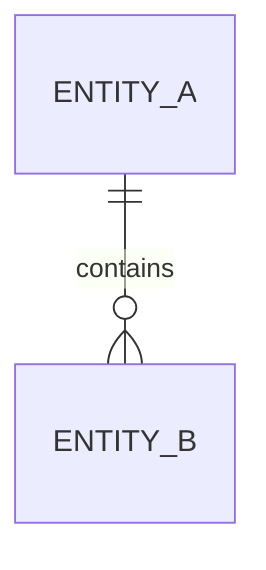
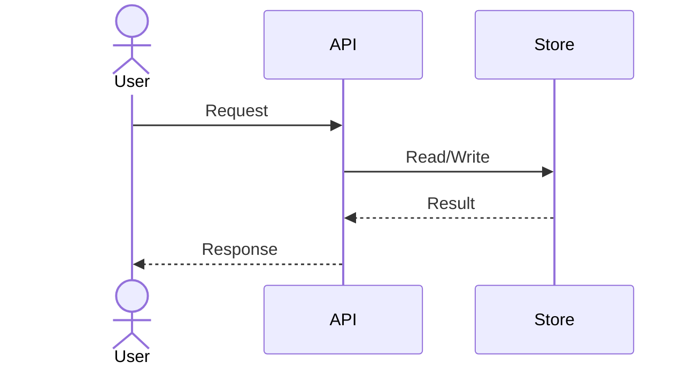

# Thiết kế cấp thấp (Low-Level Design — LLD) — {Tên component}

## 1. Mục đích component (Component Purpose)

{Mục đích và giá trị của component.}

## 2. Tham chiếu requirement (Requirement References)

- FR-001, NFR-001.

## 3. Trách nhiệm và ranh giới (Responsibilities and Boundaries)

{Component chịu trách nhiệm và chủ động không chịu trách nhiệm điều gì.}

## 4. Public interface

| ID | Interface | Đầu vào (Input) | Đầu ra (Output) | Lỗi (Errors) | Contract |
|---|---|---|---|---|---|
| API-001 | {operation} | {schema} | {schema} | {codes} | {OpenAPI link} |

## 5. Class/Module

| Module | Trách nhiệm | Phụ thuộc | Phạm vi truy cập (Visibility) |
|---|---|---|---|
| {module} | {trách nhiệm} | {phụ thuộc} | Public/Internal |

## 6. API request, response và error contract

{OpenAPI path và quy tắc versioning, pagination, error envelope.}

## 7. Data model và persistence

{Ràng buộc, index, quyền sở hữu và retention.}

## 8. Business logic

{Luật, thuật toán, thứ tự xử lý và invariant.}

## 9. Luồng sequence và state (Sequence and State Flows)

## 10. Quy tắc validation (Validation Rules)

| Trường/Rule | Điều kiện | Lỗi | Nguồn |
|---|---|---|---|
| {field} | {condition} | {code/message} | BR-001 |

## 11. Authentication và authorization

{Identity, permission, quyền sở hữu resource và hành vi từ chối truy cập.}

## 12. Error handling, retry và idempotency

{Phân loại error, timeout, retry budget, xử lý bản ghi trùng và idempotency key.}

## 13. Concurrency và transaction boundary

{Isolation, locking/optimistic control, atomicity và consistency.}

## 14. Logging, metric và tracing

{Event, che dữ liệu nhạy cảm, metric và trace span.}

## 15. Các yếu tố hiệu năng (Performance Considerations)

{Độ phức tạp, giới hạn query, caching và target dưới tải đã xác định.}

## 16. Thiết kế unit test và integration test

| Scenario | Mức test | Hành vi mong đợi | Requirement |
|---|---|---|---|
| {scenario} | Unit/Integration | {result} | FR-001 |

## 17. Ghi chú migration và compatibility

{Backward compatibility, thứ tự rollout, data migration và rollback.}

## 18. Vấn đề còn mở (Open Issues)

- {Câu hỏi, owner, deadline}.

## AI tự kiểm tra (Self-check)

- [ ] Interface và error contract không mơ hồ.
- [ ] Transaction, concurrency, retry và idempotency được xem xét.
- [ ] Test design bao phủ success, failure và boundary cases.
- [ ] Không mâu thuẫn với HLD, SRS hoặc ADR accepted.
