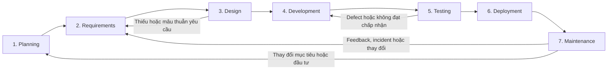
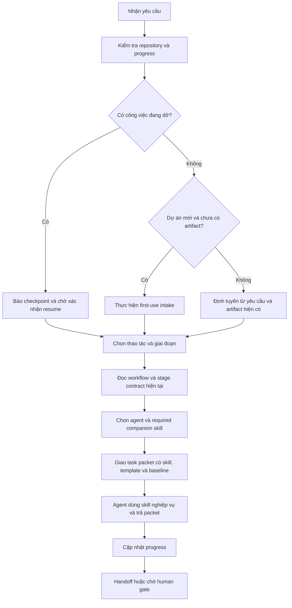

# Hướng dẫn sử dụng và tích hợp skill AI-First SDLC

> Hướng dẫn này mô tả distribution dành cho Codex. Bản Claude Code được duy trì độc lập tại [`claude-version/`](claude-version/README.md); hai bản không tự ghi đè hoặc đồng bộ khi cài đặt.

## 1. SDLC là gì và mục tiêu của SDLC

Chu trình phát triển phần mềm (Software Development Life Cycle) là một quy trình có cấu trúc được sử dụng để lập kế hoạch, thiết kế, phát triển, kiểm thử, triển khai và bảo trì phần mềm. Nó đảm bảo quy trình làm việc có hệ thống và giúp điều chỉnh quá trình phát triển phần mềm phù hợp với mục tiêu kinh doanh và yêu cầu của người dùng.

Các mục tiêu chính của SDLC gồm:

- Cung cấp một khuôn khổ phát triển rõ ràng và có hệ thống.
- Cải thiện công tác lập kế hoạch, kiểm soát chi phí và quản lý dự án.
- Đảm bảo chất lượng tốt hơn thông qua các giai đoạn kiểm tra được xác định rõ ràng.
- Giúp cung cấp phần mềm đáp ứng nhu cầu của người dùng và doanh nghiệp

## 2. Luồng SDLC thực tế



Mỗi giai đoạn sau dùng kết quả của giai đoạn trước làm đầu vào, tạo đầu ra có thể kiểm chứng và cung cấp phản hồi cho quyết định tiếp theo. Khi phát hiện sai lệch, công việc quay lại nơi chịu trách nhiệm thay vì tiếp tục trên một giả định không còn đúng.

| Giai đoạn    | Mục tiêu                                                              | Hoạt động chính                                                                        | Đầu vào → đầu ra                                                                             | Vòng phản hồi điển hình                                                                 |
| ------------ | --------------------------------------------------------------------- | -------------------------------------------------------------------------------------- | -------------------------------------------------------------------------------------------- | --------------------------------------------------------------------------------------- |
| Planning     | Xác định vấn đề, giá trị, tính khả thi, phạm vi và quyền khởi động    | Phân tích cơ hội, stakeholder, phương án, chi phí, lịch, nguồn lực và rủi ro           | Vấn đề/evidence/ràng buộc → mục tiêu, phạm vi, kế hoạch và quyết định Go/No-Go               | Kết quả vận hành hoặc thay đổi chiến lược có thể mở lại kế hoạch                        |
| Requirements | Xác định hệ thống phải làm gì và chất lượng cần đạt                   | Elicitation, phân tích As-Is/To-Be, ưu tiên, đặc tả, validation và acceptance criteria | Định hướng đã thống nhất/nhu cầu stakeholder → yêu cầu chức năng, NFR, quy tắc và truy vết   | Thiết kế không khả thi, test không đạt hoặc feedback người dùng quay lại làm rõ yêu cầu |
| Design       | Chuyển yêu cầu thành phương án kỹ thuật có thể triển khai và vận hành | Kiến trúc, dữ liệu, giao diện, API, threat modeling, lựa chọn công nghệ và trade-off   | Yêu cầu đã xác nhận/constraint → thiết kế, contract và quyết định kiến trúc                  | Prototype hoặc đánh giá kỹ thuật có thể yêu cầu sửa thiết kế hay requirement            |
| Development  | Hiện thực hóa thay đổi với chất lượng có thể kiểm tra                 | Coding, review, unit test, integration, quản lý dependency và version control          | Thiết kế/work item → source code, build, automated test và ghi nhận triển khai               | Review, build hoặc test thất bại quay lại implementation hoặc design                    |
| Testing      | Xác minh sản phẩm đáp ứng yêu cầu và đủ an toàn để phát hành          | Functional, integration, system, performance, security, regression và UAT              | Build/yêu cầu/tiêu chí chấp nhận → kết quả test, defect, coverage và quyết định UAT          | Defect quay lại Development; sai nhu cầu quay lại Requirements                          |
| Deployment   | Đưa phiên bản đã chấp nhận vào môi trường đích có kiểm soát           | Đóng gói, cấu hình, migration, smoke test, rollout, rollback và truyền thông           | Release candidate/kết luận test → phiên bản phát hành, release record và evidence triển khai | Sự cố rollout kích hoạt rollback và quay lại Development/Testing                        |
| Maintenance  | Duy trì dịch vụ, xử lý sự cố và cải tiến sản phẩm                     | Monitoring, support, incident response, problem management, vá lỗi và ưu tiên backlog  | Phiên bản đang chạy/metric/feedback → fix, postmortem, change request và cải tiến            | Feedback hoặc incident tạo một vòng Planning/Requirements mới                           |

## 3. Các vấn đề thường gặp khi áp dụng SDLC

- Bắt đầu xây dựng khi vấn đề, phạm vi hoặc người ra quyết định chưa rõ.
- Coi việc hoàn thành tài liệu là mục tiêu nhưng không xác minh giả định với người dùng và evidence thực tế.
- Viết yêu cầu mơ hồ, không đo được hoặc thiếu nguồn, dẫn đến hiểu khác nhau giữa business, development và QA.
- Để testing, NFR, security, privacy hoặc khả năng vận hành đến quá muộn.
- Thiếu liên kết giữa mục tiêu, requirement, thiết kế, code, test và phiên bản phát hành.
- Bỏ qua vòng phản hồi hoặc không đánh giá tác động khi baseline thay đổi.
- Thiết kế quá phức tạp trước khi xác minh giá trị và rủi ro cốt lõi.
- Có quy trình nhưng không rõ owner, thẩm quyền phê duyệt hoặc trách nhiệm đối với kết quả.

Các nguồn được dùng để đối chiếu phần nền tảng này:

- [GeeksforGeeks — Software Development Life Cycle](https://www.geeksforgeeks.org/software-engineering/software-development-life-cycle-sdlc/): tài liệu nhập môn về bảy giai đoạn, mô hình và lỗi áp dụng thường gặp.
- [ISO/IEC/IEEE 12207:2026 — Software life cycle processes](https://www.iso.org/standard/90219.html): khung quy trình vòng đời phần mềm có thể áp dụng đồng thời, lặp, đệ quy và tăng dần.
- [NIST SP 800-218 — Secure Software Development Framework](https://csrc.nist.gov/pubs/sp/800/218/final): thực hành phát triển an toàn cần được tích hợp vào mỗi cách triển khai SDLC.

## 4. Từ vấn đề SDLC đến nhu cầu hỗ trợ bằng skill

Các vấn đề trên tạo ra sáu yêu cầu nền tảng đối với một cơ chế hỗ trợ SDLC bằng AI:

1. Phải xác định đúng giai đoạn và không vượt dependency gate.
2. Phải phân biệt artifact, nguồn, evidence và quyết định phê duyệt.
3. Phải truy vết được mục tiêu → requirement → thiết kế → code → test → release.
4. Phải giữ lịch sử khi baseline thay đổi, thay vì âm thầm sửa bản đã duyệt.
5. Phải có human gate vì AI không có thẩm quyền nghiệp vụ, kỹ thuật hoặc phát hành.
6. Phải lưu progress/checkpoint để có thể tạm dừng, bàn giao và tiếp tục mà không dựng lại quyết định từ hội thoại.

Các yêu cầu này là cơ sở thiết kế của `ai-first-sdlc` và có thể kiểm tra trực tiếp trong repository:

| Nhu cầu của SDLC                | Cơ chế trong skill                                                                | Bằng chứng triển khai                                                                                                                                       |
| ------------------------------- | --------------------------------------------------------------------------------- | ----------------------------------------------------------------------------------------------------------------------------------------------------------- |
| Stage, dependency và human gate | Bản đồ bảy giai đoạn, chuỗi phụ thuộc và quy tắc định tuyến                       | [workflow-and-routing.md](skill/ai-first-sdlc/references/workflow-and-routing.md) và các stage reference trong `skill/ai-first-sdlc/references/`            |
| Artifact nhất quán              | Metadata, ID, version, source/related documents và lifecycle                      | [artifact-metadata.schema.json](skill/ai-first-sdlc/assets/schemas/artifact-metadata.schema.json) và template trong `skill/ai-first-sdlc/assets/templates/` |
| Traceability xuyên vòng đời     | Chuỗi `BO → FR/NFR/BR → CMP/API/ADR → WI/PR → TC → REL`                           | [SKILL.md](skill/ai-first-sdlc/SKILL.md) và Requirements Traceability Matrix template                                                                       |
| Evidence có thật                | Không cho phép tự tạo kết quả kiểm tra, URL, approval hoặc trạng thái pass        | Quy tắc trong [SKILL.md](skill/ai-first-sdlc/SKILL.md) và [validate_artifacts.py](skill/ai-first-sdlc/scripts/validate_artifacts.py)                        |
| Kiểm soát thay đổi              | Version mới giữ `document_id`, khai báo `supersedes_version` và đánh giá tác động | [workflow-and-routing.md](skill/ai-first-sdlc/references/workflow-and-routing.md) và schema metadata                                                        |
| Tạm dừng, resume và handoff     | Progress toàn dự án, progress theo stage và checkpoint                            | [progress-tracking.md](skill/ai-first-sdlc/references/progress-tracking.md) và [inspect_progress.py](skill/ai-first-sdlc/scripts/inspect_progress.py)       |
| Điều phối agent và skill       | Năm project-scoped Codex agent, mười companion skill, workflow trực tiếp và separation of duties | [project agents](.codex/agents/), các thư mục `skill/sdlc-*/`, [agent-orchestration.md](skill/ai-first-sdlc/references/agent-orchestration.md) và [agent-workflow.yaml](skill/ai-first-sdlc/references/agent-workflow.yaml) |

Nguồn bên ngoài làm cơ sở cho luồng SDLC và các nguyên tắc xuyên suốt. Các liên kết trong bảng là bằng chứng rằng những nhu cầu đó đã được hiện thực trong repository; chúng không thay thế bằng chứng dự án do nhóm phát triển tạo ra khi thực hiện công việc.

## 5. Skill dùng để làm gì

Skill `ai-first-sdlc` quản lý artifact kỹ thuật xuyên suốt vòng đời phần mềm, từ ý tưởng đến vận hành. Skill hỗ trợ sáu thao tác: tạo mới, cập nhật phiên bản, review, validate, handoff và tiếp tục công việc dang dở.

Skill dựa trên nguồn có thể kiểm chứng, duy trì traceability và theo dõi tiến độ bằng Markdown. Git là dependency lưu baseline: worktree chỉ giữ một file hiện hành cho mỗi `document_id`, còn version cũ nằm trong commit history. Skill hỏi trước khi `git init` và không tự commit/push.

Pilot có năm custom agent theo format native của Codex: Orchestrator, QA, QA Review, Development và Code Review. Mỗi agent là một file TOML có `name`, `description` và `developer_instructions`; QA sở hữu việc thu thập thông tin và viết SRS/RTM ở Requirements, đồng thời thực thi Testing. Agent review luôn độc lập với agent thực hiện.

Kiến thức nghiệp vụ không nằm trong agent definition hoặc stage reference. Mười companion skill `sdlc-*` cung cấp cách làm chuyên môn; bảy stage reference chỉ giữ input/output, traceability, blocker, human gate và handoff contract. Orchestrator ánh xạ `stage.step → agent + required_skills`, truyền rõ `$skill-name` trong task packet và block nếu skill bắt buộc không được nạp.

AI chỉ được đưa artifact do AI tạo đến `ai_checked`. Con người cung cấp quyết định, danh tính người duyệt và chuyển artifact qua human gate; AI không được tự đặt artifact thành `approved`.

Skill không thay thế SDLC. Skill chuẩn hóa cách Codex nhận biết vị trí trong vòng đời, sử dụng artifact/evidence, giữ traceability, tôn trọng human gate và bàn giao công việc. Cách tích hợp phù hợp phải giữ các nguyên tắc này dù nhóm phát triển dùng Waterfall, Agile, Scrum, Kanban hay quy trình lai.

## 6. Mô hình hoạt động của skill



Luồng thực hiện gồm tám bước:

1. Đọc yêu cầu, repository và progress hiện có.
2. Nếu có công việc dang dở, báo checkpoint và chờ người dùng quyết định có `resume` hay không.
3. Nếu là dự án mới chưa có progress hoặc artifact có ý nghĩa, thực hiện first-use intake.
4. Xác định thao tác, giai đoạn SDLC và artifact cần xử lý.
5. Đọc workflow chung và đúng một stage contract hiện tại.
6. Chọn agent cùng companion skill bắt buộc; truyền template, schema và baseline trong packet.
7. Agent thực hiện bằng skill nghiệp vụ, trả `skills_used`, output/evidence; Orchestrator validate packet và cập nhật progress.
8. Handoff câu hỏi, evidence, quyết định cần có và hành động tiếp theo.

## 7. Cách gọi skill và các thao tác

Gọi rõ skill trong prompt khi muốn chắc chắn Codex áp dụng quy trình:

```text
Dùng $ai-first-sdlc để kiểm tra repository và xác định công việc SDLC tiếp theo.
```

| Thao tác   | Khi sử dụng                                     | Hành vi chính                                                     |
| ---------- | ----------------------------------------------- | ----------------------------------------------------------------- |
| `create`   | Chưa có artifact cần thiết                      | Tạo artifact mới từ template và nguồn có thật                     |
| `update`   | Cần thay đổi artifact hiện có                   | Giữ file ổn định, mở một candidate version và dùng Git giữ baseline cũ |
| `review`   | Cần đánh giá chất lượng hoặc mức sẵn sàng       | Báo finding `blocking`, `major`, `minor`; không sửa file          |
| `validate` | Cần kiểm tra contract và evidence               | Chạy validator, sau đó kiểm tra nội dung và nguồn                 |
| `handoff`  | Cần chuyển sang người duyệt hoặc bước tiếp theo | Tổng hợp artifact, nguồn, kiểm tra, câu hỏi, human gate và owner  |
| `resume`   | Có công việc đang dở trong `_progress.md`       | Khôi phục checkpoint và chỉ tiếp tục sau khi người dùng xác nhận  |

Nếu người dùng không nêu thao tác, skill xác định thao tác từ ý định và file hiện có. Với `review`, skill không được sửa file trừ khi người dùng yêu cầu một lượt cập nhật riêng.

Discovery chuyên môn nằm trực tiếp trong `SKILL.md` của companion skill, không còn shared `guided-discovery.md`. `sdlc-project-initiation` giữ quy trình hỏi, kỹ thuật và nhóm câu hỏi cho First-use/Initiation; `sdlc-requirements-engineering` giữ toàn bộ elicitation cho Requirements. Orchestrator chỉ chuyển câu hỏi và quyết định có nguồn, không tự trả lời nghiệp vụ.

## 8. Khởi tạo dự án và first-use intake

First-use intake chỉ áp dụng khi người dùng xác nhận đây là dự án mới, hoặc repository chưa có progress lẫn artifact SDLC có ý nghĩa. Nếu đã có artifact nhưng thiếu progress, skill báo `progress_missing` và định tuyến từ artifact hiện có; không coi đó là dự án mới.

Trước khi tạo/cập nhật baseline, skill kiểm tra Git. Nếu dự án chưa có Git, agent phải xin xác nhận trước khi chạy `git init`; người dùng vẫn chủ động tạo initial commit.

Input tối thiểu để bắt đầu:

- Ý định khởi tạo dự án hoặc sản phẩm mới.
- Tên tạm thời, vấn đề/cơ hội hoặc kết quả đủ để nhận diện dự án.

Nên cung cấp thêm target user, expected value, phạm vi ban đầu, Sponsor/Product Owner, constraint, khoảng nguồn lực hoặc ngân sách, target date và evidence hiện có. Thiếu dữ liệu không ngăn việc tạo `draft`, nhưng phần chưa biết phải được ghi trong `open_questions` cùng vai trò chịu trách nhiệm trả lời.

Ví dụ:

```text
Dùng $ai-first-sdlc để khởi tạo dự án mới.

Tên tạm thời: TaskFlow
Vấn đề: nhóm nhỏ đang quản lý công việc rời rạc qua chat và bảng tính.
Người dùng: freelancer và startup.
Kết quả mong muốn: một MVP web để quản lý workspace, task và bảng Kanban.

Hãy:
1. Thực hiện first-use intake và liệt kê thông tin còn thiếu.
2. Đề xuất giai đoạn và artifact đầu tiên.
3. Tạo Project Charter ở trạng thái draft nếu đủ thông tin.
4. Không tự tạo budget, deadline, evidence hoặc approver.
5. Không tự phê duyệt tài liệu.
```

Project Management Plan cần Project Charter đã `approved`. Nếu người dùng yêu cầu tạo cả hai khi Charter chưa qua human gate, skill phải dừng tại handoff thay vì giả định Charter đã được duyệt.

### 8.1. Cách skill đặt câu hỏi

Khi cần khám phá thêm, skill kiểm tra repository trước rồi chỉ hỏi phần còn thiếu có tác động cao. Mỗi vòng thường gồm ba đến năm câu cùng chủ đề: bắt đầu bằng câu hỏi mở, tiếp tục bằng số liệu hoặc ngưỡng đo được, sau đó tóm tắt để xác nhận.

Thông tin thu được được tách thành bốn loại: sự thật đã xác minh, quyết định của con người, giả định và câu hỏi mở. Skill không hỏi toàn bộ ngân hàng câu hỏi, không hỏi lại dữ liệu đã có nguồn và không biến câu trả lời của một stakeholder thành requirement đã duyệt.

```text
Dùng $ai-first-sdlc để khởi tạo dự án mới và thực hiện discovery.
Kiểm tra repository trước, sau đó mỗi lượt chỉ hỏi tối đa 5 câu quan trọng nhất.
Tóm tắt sự thật, quyết định, giả định và câu hỏi mở sau mỗi lượt.
Khi đủ input tối thiểu, tạo Project Charter ở trạng thái draft;
không chờ mọi input khuyến nghị phải hoàn chỉnh.
```

## 9. Kiểm tra và tiếp tục dự án hiện có

Mỗi lần được gọi, skill kiểm tra:

- `docs/ai-sdlc/_progress.md` của toàn dự án.
- `_progress.md` trong bảy thư mục giai đoạn.
- Artifact, baseline, source document, work item và evidence liên quan.

Mỗi giai đoạn chỉ có một công việc đang hoạt động và dùng sáu bước chuẩn:

```text
inspect → verify_inputs → execute → validate → human_gate → handoff
```

Khi phát hiện trạng thái `in_progress`, `awaiting_user`, `awaiting_human` hoặc `blocked`, skill báo công việc, bước hiện tại, lần cập nhật cuối và hành động tiếp theo. Skill không tự `resume`.

```text
Dùng $ai-first-sdlc để kiểm tra progress hiện tại.
Nếu có công việc đang dở, hãy báo checkpoint và bước tiếp theo.
Không tự resume cho đến khi tôi xác nhận.
```

Sau khi kiểm tra, người dùng có thể yêu cầu:

```text
Resume công việc Requirements đang dở tại checkpoint hiện tại.
Không lặp lại bước đã completed và cập nhật progress sau mỗi bước.
```

### 9.1. Khám phá yêu cầu

Trong Requirements, `qa-agent` dùng `$sdlc-requirements-engineering` để thu thập thông tin và viết SRS/RTM; `qa-review-agent` dùng `$sdlc-requirements-review` để review độc lập khả năng kiểm thử, nguồn, NFR và traceability. QA Agent không tự trả lời câu hỏi nghiệp vụ; kết quả chỉ thành requirement khi có nguồn hoặc quyết định Product Owner.

```text
Dùng $ai-first-sdlc để hỗ trợ elicitation cho Requirements.
Đọc artifact và nguồn hiện có trước, xác định stakeholder cùng kỹ thuật phù hợp,
rồi hỏi mỗi lượt tối đa 5 câu còn thiếu có tác động cao nhất.
Ghi nguồn, xung đột, giả định và open_questions; không tự coi candidate
requirement là đã được Product Owner phê duyệt.
```

## 10. Cấu trúc repository ứng dụng đề xuất

```text
my-application/
├── .codex/
│   └── agents/
│       ├── sdlc-orchestrator-agent.toml
│       ├── qa-agent.toml
│       ├── qa-review-agent.toml
│       ├── development-agent.toml
│       └── code-review-agent.toml
├── AGENTS.md
├── docs/
│   └── ai-sdlc/
│       ├── _progress.md
│       ├── 01-initiation/_progress.md
│       ├── 02-requirements/_progress.md
│       ├── 03-design/_progress.md
│       ├── 04-development/_progress.md
│       ├── 05-testing/_progress.md
│       ├── 06-release/_progress.md
│       └── 07-operations/_progress.md
├── src/
├── tests/
├── scripts/
└── README.md
```

- `docs/ai-sdlc/`: artifact chính thức, baseline và progress.
- `src/`: source code.
- `tests/`: unit, integration, system và performance test.
- `AGENTS.md`: quy tắc cố định mà Codex phải tuân theo trong repository ứng dụng.
- Work item, PR và commit nên tham chiếu ID như `FR-001`, `NFR-001`, `ADR-0001` hoặc defect ID.

## 11. Các cách tích hợp skill

### 11.1. Bản nguồn trong repository phát triển skill

Trong repository này, `skill/ai-first-sdlc/` và mười thư mục `skill/sdlc-*/` là bản nguồn chuẩn để phát triển, review và kiểm thử. Các skill nằm ngang hàng; không lồng companion skill trong `ai-first-sdlc`. Không coi thư mục nguồn là user skill đã được cài đặt.

### 11.2. Codex user skill

Theo discovery path hiện hành, cài các skill ngang hàng tại:

```text
%USERPROFILE%\.agents\skills\
├── ai-first-sdlc\
├── sdlc-project-initiation\
├── sdlc-requirements-engineering\
├── sdlc-requirements-review\
├── sdlc-solution-design\
├── sdlc-software-development\
├── sdlc-code-review\
├── sdlc-software-testing\
├── sdlc-test-review\
├── sdlc-release-management\
└── sdlc-service-operations\
```

Bộ này có thể được dùng trong mọi repository của người dùng. Sau khi bản nguồn đạt validation, cần đồng bộ hoặc cài lại cả skill gốc lẫn companion skills bằng quy trình cài đặt đang áp dụng. Thiếu companion skill bắt buộc làm step `blocked`.

Một số Codex surface hoặc installation cũ có thể discovery `%USERPROFILE%\.codex\skills\`. Chỉ dùng đường dẫn này sau khi xác minh trên môi trường đích; không duy trì hai bản cùng tên ở cả hai vị trí.

### 11.3. Skill thuộc repository ứng dụng

Để cả nhóm dùng cùng một phiên bản, đặt skill tại:

```text
my-application/
└── .agents/
    └── skills/
        ├── ai-first-sdlc/
        ├── sdlc-project-initiation/
        ├── sdlc-requirements-engineering/
        ├── sdlc-requirements-review/
        ├── sdlc-solution-design/
        ├── sdlc-software-development/
        ├── sdlc-code-review/
        ├── sdlc-software-testing/
        ├── sdlc-test-review/
        ├── sdlc-release-management/
        └── sdlc-service-operations/
```

Không duy trì hai bản skill cùng tên nhưng khác nội dung ở cấp user và repository trong cùng môi trường làm việc.

### 11.4. Cấu hình agent của dự án

Định nghĩa custom agent trực tiếp tại `<project-root>/.codex/agents/*.toml`. Đây là vị trí project-scoped được Codex discovery; agent dùng cá nhân trên nhiều dự án nằm tại `%USERPROFILE%/.codex/agents/`.

Không đặt custom agent trong `skill/ai-first-sdlc/agents/`: theo cấu trúc skill, thư mục đó chỉ giữ `openai.yaml` cho UI metadata, invocation policy và dependency metadata. Cũng không đặt agent trong `assets/`, vì `assets/` dành cho template hoặc file được skill dùng để tạo đầu ra.

Repository này giữ năm định nghĩa chạy thật tại `.codex/agents/`. Sau khi thêm hoặc đổi custom agent, mở phiên Codex mới để chắc chắn cấu hình được discovery.

Sao chép `skill/ai-first-sdlc/assets/templates/config.yaml` thành `.ai-sdlc/config.yaml` và đổi `target` thành native agent name hoặc định danh agent công ty. Có binding thì Orchestrator giao target đã cấu hình; thiếu binding thì spawn agent đã được Codex discovery theo `name`. Nếu agent hoặc `required_skills` chưa được discovery, step bị block; không chạy prompt trong cùng execution để giả lập agent/skill. QA/QA Review và Development/Code Review không được dùng cùng target hoặc execution identity.

`skill/ai-first-sdlc/agents/openai.yaml` chỉ cấu hình cách skill hiển thị và được gọi; file này không định nghĩa custom agent.

### 11.5. Bản Claude Code

Bản Claude Code nằm tại `claude-version/.claude/` và sử dụng:

- `.claude/skills/<skill-name>/SKILL.md`
- `.claude/agents/<agent-name>.md`
- YAML frontmatter và Markdown system prompt
- Companion skill preload qua trường `skills`

Không sao chép agent TOML hoặc `agents/openai.yaml` của Codex sang Claude. Xem [hướng dẫn cài và chạy bản Claude](claude-version/README.md).

## 12. Cấu hình AGENTS.md cho repository ứng dụng

```md
# Quy tắc phát triển dự án

## AI-First SDLC

- Dùng `$ai-first-sdlc` cho planning, requirements, design, implementation,
  testing, release và operations.
- Lưu artifact và progress tại `docs/ai-sdlc/`.
- Không triển khai requirement chưa qua cổng đầu vào bắt buộc.
- Mọi thay đổi code phải tham chiếu requirement hoặc defect ID.
- Quyết định kiến trúc quan trọng phải có ADR.
- Không tuyên bố test pass nếu thiếu command và evidence.
- AI chỉ được chuyển artifact đến `ai_checked`.
- Chỉ con người được cung cấp approval decision và approver identity.

## Verification

Trước khi hoàn thành implementation:

1. Chạy build và static analysis phù hợp.
2. Chạy unit test và integration test.
3. Cập nhật Implementation Report và RTM.
4. Ghi command, kết quả và evidence có thật.
```

## 13. Áp dụng dependency và human gate

Bảng ở phần 2 mô tả đầu vào, đầu ra và vòng phản hồi của từng giai đoạn. Khi áp dụng vào dự án cụ thể, repository có thể thay tên vai trò nhưng phải xác định rõ ai có thẩm quyền cho từng loại quyết định.

- Đầu ra đã `approved` của giai đoạn trước thường là bản cơ sở cho giai đoạn sau.
- Có thể chuẩn bị artifact `draft` cho giai đoạn sau khi người dùng yêu cầu rõ, nhưng phải ghi dependency còn thiếu và không thể hiện như gate đã đạt.
- AI chỉ được đưa artifact do AI tạo đến `ai_checked`; trạng thái này thể hiện đã tự kiểm tra, không phải phê duyệt.
- Chỉ ghi `human_decision`, người duyệt và thời điểm khi quyết định đã thực sự được cung cấp.
- Nếu review hoặc test phát hiện vấn đề làm thay đổi baseline, quay lại giai đoạn chịu trách nhiệm, mở một candidate version trong file hiện hành và cập nhật liên kết. Baseline cũ phải đã commit.

## 14. Validate artifact

Chạy validator từ root dự án:

```powershell
python "<skill-root>\scripts\validate_artifacts.py" docs\ai-sdlc
```

Ví dụ khi phát triển skill trong repository này:

```powershell
python "skill\ai-first-sdlc\scripts\validate_artifacts.py" <artifact-path-or-docs-root>
python "skill\ai-first-sdlc\scripts\validate_agents.py" "skill\ai-first-sdlc" [".ai-sdlc\config.yaml"] "<project-root>"
python "skill\ai-first-sdlc\scripts\migrate_artifact_storage.py" "docs\ai-sdlc"
```

Artifact validator kiểm tra metadata, một live file cho mỗi document ID, Git baseline/history, lifecycle, liên kết và traceability. Agent validator kiểm tra schema TOML native trong `<project-root>/.codex/agents/`, đủ năm agent, đủ mười companion skill, workflow 7×6, required skill, human gate và separation of duties. Dùng `-` thay tham số config khi dự án chưa có `.ai-sdlc/config.yaml`. Migration mặc định dry-run; chỉ thêm `--apply` sau safety commit, sau đó commit file ổn định và chạy lại artifact validator bình thường.

## 15. Human approval và handoff

Khi phê duyệt, con người phải cung cấp rõ danh tính, vai trò, artifact, version, quyết định và ngày quyết định:

```text
Tôi là Nguyễn Văn A, vai trò Sponsor.
Tôi phê duyệt PC-PROJECT-001 phiên bản 1.0.0 ngày 2026-07-23.
Hãy ghi nhận quyết định và handoff sang bước tiếp theo.
```

Mỗi handoff phải cho biết thao tác/giai đoạn, artifact, nguồn đã duyệt, kiểm tra hoặc finding, câu hỏi mở, human gate, bước tiếp theo và progress hiện tại.

## 16. Prompt sử dụng thường xuyên

### Kiểm tra trạng thái

```text
Dùng $ai-first-sdlc để kiểm tra repository hiện tại.
Hãy báo progress, artifact hiện tại, nguồn đã approved,
câu hỏi mở, human gate và đúng một hành động tiếp theo.
Không tự resume hoặc sửa file.
```

### Review artifact

```text
Dùng $ai-first-sdlc để review <artifact-path>.
Báo finding theo blocking, major và minor, kèm section hoặc line.
Không sửa file.
```

### Cập nhật artifact

```text
Dùng $ai-first-sdlc để update <artifact-path> từ baseline hiện tại.
Xác minh baseline đã commit, giữ document_id và tên file ổn định,
mở một candidate version, ghi impact và không tự commit/push.
```

### Validate và handoff

```text
Dùng $ai-first-sdlc để validate <artifact-path> và chuẩn bị handoff.
Chỉ ghi evidence thực sự tồn tại và nêu rõ human decision cần có.
```

## 17. Nguyên tắc bắt buộc

- Không biến assumption hoặc suy luận của AI thành requirement hay decision đã duyệt.
- Không hỏi lại dữ liệu đã có nguồn hoặc bắt người dùng trả lời toàn bộ ngân hàng câu hỏi; chỉ hỏi khoảng trống có tác động đến artifact hay gate hiện tại.
- Không tự tạo evidence, deadline, budget, authority hoặc approver.
- Không tự điền `human_decision` hoặc `human_approved_at`.
- Artifact `approved` không được còn `open_questions` hoặc placeholder.
- Không báo test pass khi thiếu command và evidence.
- Requirement, design, implementation, test và release phải truy vết được.
- Khi baseline thay đổi, mở candidate version trong file hiện hành hoặc ADR thay thế; Git giữ lịch sử và agent không tự commit/push.
- QA Agent viết Requirements và thực thi Testing; QA Review Agent phải độc lập. Development và Code Review cũng phải độc lập.
- Stage reference chỉ giữ contract; nghiệp vụ chuyên môn nằm trong companion skill được workflow yêu cầu.
- Agent phải dùng đúng `required_skills`, khai báo `skills_used`; thiếu skill bắt buộc phải block.
- Cập nhật progress sau mỗi bước có ý nghĩa và trước khi chờ người dùng hoặc human gate.

## 18. Phát triển và bảo trì skill

Trong repository phát triển này, `skill/ai-first-sdlc/` và `skill/sdlc-*/` là nguồn chuẩn. Khi thay đổi source làm thay đổi cách người dùng gọi, cấu hình, cung cấp input, hiểu output, theo dõi progress, resume, dùng trạng thái/human gate hoặc đặt file, phải cập nhật tài liệu này trong cùng thay đổi.

Quy tắc bắt buộc cho agent phát triển được đặt tại `AGENTS.md` ở root repository. Thay đổi nội bộ không ảnh hưởng cách sử dụng, như refactor script, bổ sung test hoặc sửa lỗi chính tả nội bộ, không bắt buộc sửa hướng dẫn.
